# Waas.Notification.Contracts

Contracts for Watts-as-a-Service (WaaS) public events.

## Status
- Intended for NuGet distribution, but the feed is not public right now (as of 2026-03).
- Use this repository as a reference for event schemas.

## Event hierarchy

```mermaid
classDiagram
    class BaseEvent
    class DeviceEvent {
        +string DeviceId
    }
    class AnalyticsSucceededEvent {
        +DateTime AnalyticsStart
        +DateTime AnalyticsEnd
    }
    class DeviceFailureEvent {
        +string ReasonOfFailure
    }

    BaseEvent <|-- DeviceEvent
    BaseEvent <|-- SpotPricesAvailable
    BaseEvent <|-- SpotPriceForecastsAvailable
    BaseEvent <|-- WeatherForecastsCollected
    BaseEvent <|-- WeatherForecastsHistoryCollected
    BaseEvent <|-- TransportationPricesAvailable
    BaseEvent <|-- CO2AndOriginForecastsAvailable
    BaseEvent <|-- ConsumptionBatchProcessingSucceeded
    BaseEvent <|-- ConsumptionBatchProcessingFailed
    BaseEvent <|-- ConsumptionBatchValidationFailed
    BaseEvent <|-- ConsumptionBatchDeviceOnboardingsMissing

    DeviceEvent <|-- ConsumptionsAvailable
    DeviceEvent <|-- DeviceProvisioned
    DeviceEvent <|-- DeviceUnProvisioned
    DeviceEvent <|-- ProvisionedDeviceUpdated
    DeviceEvent <|-- AnalyticsSucceededEvent
    DeviceEvent <|-- DeviceFailureEvent

    AnalyticsSucceededEvent <|-- HouseConsumptionForecastSucceeded
    AnalyticsSucceededEvent <|-- HouseConsumptionForecastFailed
    AnalyticsSucceededEvent <|-- HeatingConsumptionForecastSucceeded
    AnalyticsSucceededEvent <|-- HeatingConsumptionForecastFailed
    AnalyticsSucceededEvent <|-- BaseConsumptionForecastSucceeded
    AnalyticsSucceededEvent <|-- BaseConsumptionForecastFailed
    AnalyticsSucceededEvent <|-- ConsumptionDisaggregationSucceeded
    AnalyticsSucceededEvent <|-- ConsumptionDisaggregationFailed
    AnalyticsSucceededEvent <|-- HouseConsumptionForecastsAvailable
    AnalyticsSucceededEvent <|-- HeatingConsumptionForecastsAvailable
    AnalyticsSucceededEvent <|-- BaseConsumptionForecastsAvailable
    AnalyticsSucceededEvent <|-- BaseConsumptionEstimatesAvailable
    AnalyticsSucceededEvent <|-- EvConsumptionEstimatesAvailable
    AnalyticsSucceededEvent <|-- HeatingConsumptionEstimatesAvailable
```



## Event catalog

| Event | Category | Scope | Key fields |
|---|---|---|---|
| `DeviceProvisioned` | Device lifecycle | Device | `DeviceId`, `Type` ([`DeviceType`](Waas.Notification.Contracts/Enums/DeviceType.cs)), `Longitude`, `Latitude`, `StartDateTime`, household config |
| `DeviceUnProvisioned` | Device lifecycle | Device | `DeviceId` |
| `ProvisionedDeviceUpdated` | Device lifecycle | Device | `DeviceId`, household config fields |
| `ConsumptionsAvailable` | Consumption data | Device | `DeviceId`, `BatchTimeSeriesDuration` ([`TimeSeriesDuration`](Waas.Notification.Contracts/Enums/TimeSeriesDuration.cs)), `LastTimestampInBatch` |
| `ConsumptionBatchProcessingSucceeded` | Consumption batch | Batch | `BatchId` |
| `ConsumptionBatchProcessingFailed` | Consumption batch | Batch | `BatchId`, `ReasonOfFailure` |
| `ConsumptionBatchValidationFailed` | Consumption batch | Batch | `BatchId`, `Errors` |
| `ConsumptionBatchDeviceOnboardingsMissing` | Consumption batch | Batch | `BatchId`, `NotOnboardedDeviceIds` |
| `HouseConsumptionForecastSucceeded` | Forecasting | Device | `DeviceId`, `AnalyticsStart`, `AnalyticsEnd` |
| `HouseConsumptionForecastFailed` | Forecasting | Device | `DeviceId`, `ReasonOfFailure` |
| `HouseConsumptionForecastsAvailable` | Forecasting | Device | `DeviceId` |
| `HeatingConsumptionForecastSucceeded` | Forecasting | Device | `DeviceId`, `AnalyticsStart`, `AnalyticsEnd` |
| `HeatingConsumptionForecastFailed` | Forecasting | Device | `DeviceId`, `ReasonOfFailure` |
| `HeatingConsumptionForecastsAvailable` | Forecasting | Device | `DeviceId` |
| `HeatingConsumptionEstimatesAvailable` | Forecasting | Device | `DeviceId` |
| `BaseConsumptionForecastSucceeded` | Forecasting | Device | `DeviceId`, `AnalyticsStart`, `AnalyticsEnd` |
| `BaseConsumptionForecastFailed` | Forecasting | Device | `DeviceId`, `ReasonOfFailure` |
| `BaseConsumptionForecastsAvailable` | Forecasting | Device | `DeviceId` |
| `BaseConsumptionEstimatesAvailable` | Forecasting | Device | `DeviceId` |
| `EvConsumptionEstimatesAvailable` | Forecasting | Device | `DeviceId` |
| `ConsumptionDisaggregationSucceeded` | Disaggregation | Device | `DeviceId`, `AnalyticsStart`, `AnalyticsEnd` |
| `ConsumptionDisaggregationFailed` | Disaggregation | Device | `DeviceId`, `ReasonOfFailure` |
| `SpotPricesAvailable` | Market | Global | `BiddingZone`, `From`, `To` |
| `SpotPriceForecastsAvailable` | Market | Global | `BiddingZone`, `From`, `To` |
| `TransportationPricesAvailable` | Market | Global | `CountryCode`, `GridAreaId`, `From`, `To` |
| `WeatherForecastsCollected` | Environment | Global | `From`, `To` |
| `WeatherForecastsHistoryCollected` | Environment | Global | — |
| `CO2AndOriginForecastsAvailable` | Environment | Global | `From`, `To` |

> **Scope — Device** events carry a `DeviceId` and are scoped to a single metered device. **Global** events are not device-scoped (market prices, weather, CO2).

## Quick start

Until the NuGet feed is public, clone this repo and add a project reference:

```xml
<ProjectReference Include="../Waas.Notification.Contracts/Waas.Notification.Contracts.csproj" />
```

Or build a local package and reference it from a local NuGet source:

```bash
dotnet pack
```

### Publishing an event

```csharp
using Waas.Notification.Contracts.CloudEvents;
using Waas.Notification.Contracts.Events;

var cloudEvent = new NotificationCloudEvent<SpotPricesAvailable>(
    id: Guid.NewGuid().ToString(),
    type: "waas.market.spot-prices-available",
    data: new SpotPricesAvailable("DK1", DateTime.UtcNow, DateTime.UtcNow.AddHours(24)),
    trackingId: Guid.NewGuid().ToString("D"),
    time: DateTimeOffset.UtcNow);

var json = JsonSerializer.Serialize(cloudEvent);
```

### Consuming an event via Azure.Messaging.CloudEvent

```csharp
using Azure.Messaging;
using Waas.Notification.Contracts.CloudEvents;

// On receive:
string trackingId = incomingCloudEvent.GetOrCreateTrackingId();
var data = incomingCloudEvent.Data.ToObjectFromJson<SpotPricesAvailable>();
```

